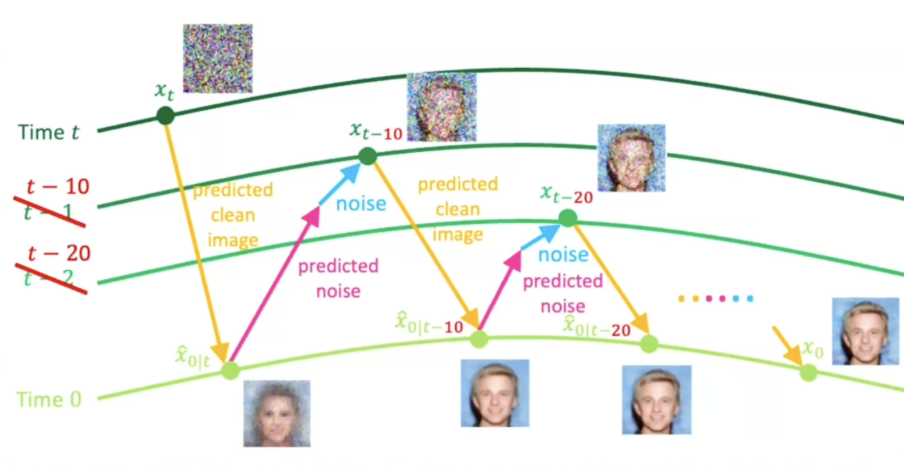
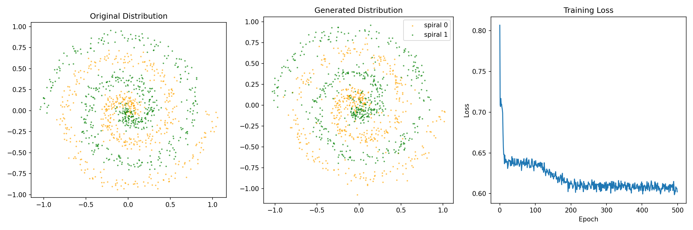
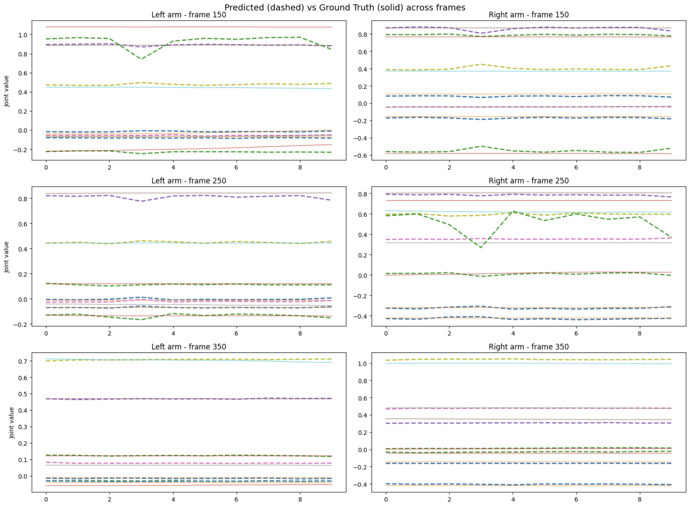

# Difflow

Library for diffusion and flow matching models.

The goal here is to provide simple implementations to anyone who is starting out in this field. For in-depth implementations check out [diffusers](https://github.com/huggingface/diffusers).

## Installation

```bash
git clone https://github.com/kalashjain23/difflow.git
cd difflow
uv pip install -e .
```

## How to use

There are scripts in the `examples/` folder that you can run to train and sample from the implemented models. The scripts are minimal by nature to not raise any confusion other than the working of the model itself. The core modules used in the architecture are also implemented from scratch.

| Model | Train | Sample |
|-------|-------|--------|
| DDPM | `python3 examples/train_ddpm.py` | `python3 examples/sample_ddpm.py` |
| DDIM | (reuse DDPM checkpoint) | `python3 examples/sample_ddim.py` |
| Flow Matching | `python3 examples/train_flow_matching.py` | `python3 examples/sample_flow_matching.py` |
| Pi0 | `python3 examples/train_pi0.py` | `python3 examples/sample_pi0.py` |

If you're new to this, start with **Flow Matching** (simplest), then **DDPM**, then **Pi0**.

## Models

### [DDPM](difflow/models/ddpm.py)

DDPM (Denoising Diffusion Probabilistic Model) follows a forward noising process and a reverse denoising process. In the forward process, we add noise (Gaussian) to the data distribution at each time step. This ensures we are gradually reducing the signal from the data distribution and increasing the noise. In the manifold space, it helps in spreading out the complex data distribution to a smoother distribution (forward process ensures that the distribution in the end is Gaussian). While in the reverse process, we sample a noisy data point from complete noise and gradually try to denoise it to generate something meaningful. We train a model (here UNet) that predicts noise during the reverse process given a noisy sample and the timestep. You can imagine this as picking a data point in the high dimensional manifold space and moving towards the high density regions by reducing the noise. (Note: we also add some Gaussian noise while removing the noise to add stochasticity which allows the model to explore more and generate varying samples)

<p align="center">
  
  <br/>
  <a href="https://developer.nvidia.com/blog/improving-diffusion-models-as-an-alternative-to-gans-part-2/">Source</a>
</p>

### [DDIM](difflow/models/ddim.py)

DDIM (Denoising Diffusion Implicit Model) is just a sampler swap for DDPM. In DDIM, we predict the clean image from the current noise level (in DDPM, we predicted the image at the next time step not the final time step) and then add back the predicted noise. This sounds deterministic right? It is, as there is no random noise added which allows DDIM to sample much faster (10x-20x) than DDPM and achieve similar results.

<p align="center">
  
  <br/>
  <a href="https://youtu.be/6-gp8fR9r8w?si=Cc_mBj8sla1jjgAa&t=1098">Source</a>
</p>

### [Flow Matching](difflow/models/flow_matching.py) (2D data distribution)

Flow Matching follows the simple concept of adding noise to the data distribution via linear interpolation between the data and noise, that is, reduce signal while increasing noise (sounds similar to ddpm forward process right? well it is lol), and learn a vector field that points towards the nearest high density regions. The idea is that if we take a random sample in the high dimensional space and use the learned vector field to guide ourselves towards the high density regions where the data distribution actually exists. In this implementation, we have a small FFN (feed forward network) as the model learning the vector field of a small 2D dataset. While training, we interpolate the data distribution and try to predict the vector field using the model. The loss here becomes the L2 loss between the actual vector field (pure signal sample - pure noise) and the predicted vector field. Minimizing this gives us the learned vector field that can guide us towards the high density regions (closer to the data distribution). Notice, we are not adding additional noise while going from the low density region to high density region. Mathematically, this boils down to solving an ODE (ordinary differential equation) rather than a SDE (stochastic differential equation) used in diffusion models making it easier and faster to compute but less explorable.

<p align="center">
  
  <br/>
  <a href="https://medium.com/@hasfuraa/flow-matching-and-diffusion-deep-dive-b080f7782654">Source</a>
</p>

### [Pi0](difflow/models/pi0.py) (only the flow matching action expert head)

This follows the same principle as the flow matching model above, but instead of sampling 2D points, we are now sampling actions for each joint of the robot. The path is similar, sample a noisy vector of actions and pass it through the action head to get the final vector of actions. Now in the action head, we are passing the (joint state embeddings and the action embeddings) and (vlm tokens embeddings) through a transformer. We have 2 experts, one for the action and state and one for the vlm tokens. In the transformer, they share the same attention block with a blockwise causal mask where VLM tokens attend to themselves, state tokens attend to vlm tokens and themselves and action tokens attend to everything. This ensures actions are influenced by the images, prompts and the current robot joint states.

<p align="center">
  
  <br/>
  <a href="https://arxiv.org/pdf/2410.24164v1">Source</a>
</p>

## References

- [Denoising Diffusion Probabilistic Models (Ho et al., 2020)](https://arxiv.org/abs/2006.11239)
- [Flow Matching for Generative Modeling (Lipman et al., 2023)](https://arxiv.org/abs/2210.02747)
- [Pi0: A Vision-Language-Action Flow Model for General Robot Control (Black et al., 2024)](https://arxiv.org/abs/2410.24164)

## Results

### DDPM


### DDIM


### Flow Matching


### Pi0
Trained on [ALOHA sim insertion](https://huggingface.co/datasets/lerobot/aloha_sim_insertion_human) dataset (10 epochs, batch size 2).

Predicted (dashed) vs ground truth (solid) action trajectories across different frames (kinda follows the ground truth with less training):

